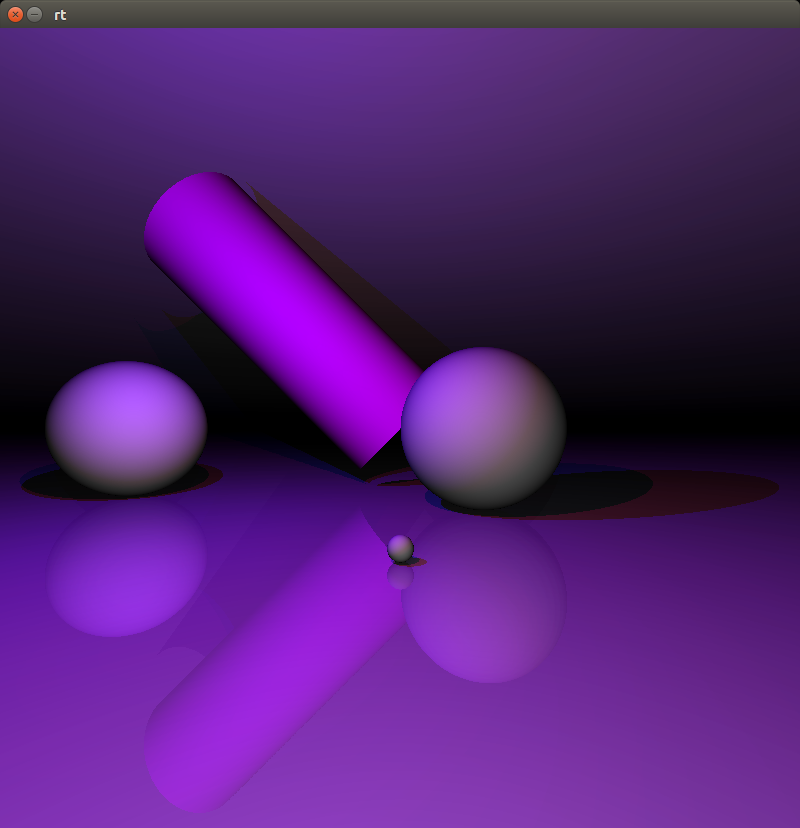

# raytracer
Basic raytracer written in C



[Demo video](https://www.youtube.com/watch?v=FAS77x5FcMo)

## Usage 
Require CSFML-2.2 and SFML-2.2 libraries.
```
make && ./raytracer ./scenes/example_1.rt
```

## Scenes format
This files describe objects present in the scene.

```yaml
# CAMERA
camera:
  position: 0 0 3 # x y z
  rotation: 0 1 0 # x y z
  kepsilon: 0.0001

# OBJECTS
plane:
  position: 0 -1 0    # x y z
  rotation: 1 0 2     # x y z
  color: 255 255 255  # r g b | wood | perlin x
  reflection: .1      # float between 0 and 1

sphere:
  # properties shown in plane object can be used here
  parameter: 1 # radius
  
cone:
  # properties shown in plane object can be used here
  parameter: 1 2 # alpha height
  
cylinder:
  # properties shown in plane object can be used here
  parameter: 2 3 # radius height
  
# LIGHTS
light:
  position: 0 0 5 # x y z
  color: 255 0 0  # r g b
  power: .4       # float between 0 and 1

```
